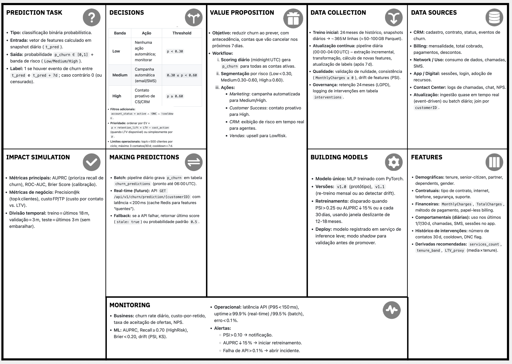

# Tech Challenge (GRUPO 106) - Fase 1: Predição de Churn em Telecom

[](https://www.python.org/)
[](https://docs.astral.sh/ruff/)
[](https://mypy.readthedocs.io/)
[](https://pytest.org/)
[](https://g13-mle.github.io/tech-challenge-fase-1/)
[](https://g13-mle.github.io/tech-challenge-fase-1/)
[](./MODEL_CARD.md)

Pipeline end-to-end de Machine Learning para predição de churn em
telecomunicações. Inclui baselines com scikit-learn, modelo MLP com PyTorch,
rastreamento de experimentos via MLflow, API de inferência com FastAPI,
observabilidade com Prometheus/Grafana e EDA interativo com Marimo.

## Sumário

- [Visão Geral](#visão-geral)
- [Resultados](#resultados)
- [Estrutura do Repositório](#estrutura-do-repositório)
- [Dataset](#dataset)
- [Instalação e Setup](#instalação-e-setup)
- [Como Usar](#como-usar)
- [Como Executar Localmente](#como-executar-localmente)
- [Como Fazer Deploy](#como-fazer-deploy)
- [EDA Interativo](#eda-interativo-marimo)
- [Stack e Versões](#stack-e-versões)
- [Model Card](#model-card)
- [Roadmap](#roadmap)
- [Autores](#autores)

## Visão Geral

### O Problema

Em telecomunicações, churn (cancelamento de clientes) representa perda
direta de receita. Antecipar quais clientes vão cancelar permite direcionar
ações de retenção de forma eficiente, reduzindo custos e melhorando a
experiência do cliente.

### A Solução

Pipeline completo de ML cobrindo exploração, pré-processamento,
modelagem, rastreamento, serviço e observabilidade:

1. **EDA interativo** com Marimo (WASM para navegador, Python para local)
2. **Pré-processamento** one-hot encoding, StandardScaler, split
   estratificado
3. **Modelagem** MLP (PyTorch) + baselines DummyClassifier e Logistic
   Regression
4. **Tuning** hiperparâmetros do MLP com Optuna
5. **Rastreamento** MLflow para métricas, parâmetros e artefatos
6. **Análise comparativa** relatório automatizado de experimentos
7. **API** FastAPI com validação Pydantic, health check, metrics
   Prometheus e drift detection
8. **Observabilidade** Prometheus + Grafana com dashboards
   provisionados

### Nota sobre o ML Canvas



O **ML Canvas** (disponível em `docs/ML_CANVAS.pdf`) descreve um **cenário futuro e ideal** de produção para o projeto de churn, projetando um ambiente operacional completo com, por exemplo: pipeline de batch diário (scoring à meia-noite UTC), escala de ~365M linhas (24 meses de histórico), integração operacional com CRM, CS, Marketing e Sales, cache Redis, fallbacks, shadow mode, canary deploy governança LGPD. Esses elementos compõem um **cenário lúdico de enriquecimento**, útil para demonstrar visão de produto e planejamento de MLOps, mas **não fazem parte dos requisitos do Tech Challenge Fase 1**.

O código deste repositório implementa os entregáveis das
**4 Etapas do Desafio**. Veja o mapeamento detalhado abaixo.

---

## Entregáveis do Tech Challenge por Etapa

### Etapa 1 -- Entendimento e Preparação

| Requisito | Status | Localização |
|-----------|--------|-------------|
| ML Canvas (stakeholders, métricas de negócio, SLOs) | [OK] | [`docs/ML_CANVAS.pdf`](docs/ML_CANVAS.pdf), [`docs/ML_CANVAS.png`](docs/ML_CANVAS.png) |
| EDA completa (volume, qualidade, distribuição, readiness) | [OK] | [`notebooks/01_eda.py`](notebooks/01_eda.py) (Marimo, 1404 linhas) |
| Métrica técnica (AUC-ROC, PR-AUC, F1) + métrica de negócio (custo) | [OK] | [`src/training/metrics.py`](src/training/metrics.py) (L105-478), [`docs/RESULTADOS_BASELINE.md`](docs/RESULTADOS_BASELINE.md) |
| Baseline DummyClassifier + Logistic Regression (scikit-learn) | [OK] | [`src/pipelines/run_dummy_baseline.py`](src/pipelines/run_dummy_baseline.py), [`src/pipelines/run_logistic_regression.py`](src/pipelines/run_logistic_regression.py), [`src/training/dummy_trainer.py`](src/training/dummy_trainer.py), [`src/training/logistic_trainer.py`](src/training/logistic_trainer.py) |
| Registro de experimentos no MLflow (parâmetros, métricas, dataset version) | [OK] | [`src/training/mlflow_tracking.py`](src/training/mlflow_tracking.py), [`src/data/versioning.py`](src/data/versioning.py) |

**Entregável Etapa 1:** notebook de EDA +
baselines registrados no MLflow.

### Etapa 2 -- Modelagem com Redes Neurais

| Requisito | Status | Localização |
|-----------|--------|-------------|
| MLP em PyTorch (arquitetura, ativação, loss function) | [OK] | [`src/training/mlp/model.py`](src/training/mlp/model.py) (Linear->BatchNorm->ReLU->Dropout->Linear, BCEWithLogitsLoss) |
| Loop de treinamento com early stopping e batching | [OK] | [`src/training/mlp/trainer.py`](src/training/mlp/trainer.py) (DataLoader, epochs, scheduler), [`src/training/mlp/early_stopping.py`](src/training/mlp/early_stopping.py) |
| Comparar MLP vs. baselines (>= 4 métricas) | [OK] | [`src/pipelines/run_compare_models.py`](src/pipelines/run_compare_models.py), [`docs/MLP_VERSUS_BASELINE.md`](docs/MLP_VERSUS_BASELINE.md) (7 métricas + custo) |
| Análise trade-off custo FP/FN | [OK] | [`src/training/metrics.py`](src/training/metrics.py) (L410-478: analyze_threshold_tradeoff), [`reports/threshold_comparison.csv`](reports/threshold_comparison.csv) |
| Registrar experimentos no MLflow | [OK] | Todos os pipelines registram runs com params, métricas, artefatos e `model_card.json` |

**Entregável Etapa 2:** tabela comparativa de modelos +
MLP treinado + artefatos no MLflow.

### Etapa 3 -- Engenharia e API

| Requisito | Status | Localização |
|-----------|--------|-------------|
| Refatoração em módulos `src/` | [OK] | [`src/api/`](src/api/), [`src/config/`](src/config/), [`src/data/`](src/data/), [`src/features/`](src/features/), [`src/inference/`](src/inference/), [`src/pipelines/`](src/pipelines/), [`src/schemas/`](src/schemas/), [`src/training/`](src/training/), [`src/tools/`](src/tools/) |
| Pipeline reprodutível (sklearn + transformadores custom) | [OK] | [`src/features/pipeline.py`](src/features/pipeline.py) (Pipeline com Imputer, Scaler, OHE, SMOTE), [`src/data/preprocessing.py`](src/data/preprocessing.py) |
| Testes pytest (unitários, schema Pandera, smoke test) | [OK] | [`tests/`](tests/) (28+ arquivos), [`tests/test_api.py`](tests/test_api.py) (smoke test + API), [`tests/test_pandera_schema.py`](tests/test_pandera_schema.py) (schema validation), [`tests/data/test_validation.py`](tests/data/test_validation.py) |
| API FastAPI: `/predict`, `/health`, validação Pydantic | [OK] | [`src/api/main.py`](src/api/main.py), [`src/api/schemas.py`](src/api/schemas.py) (PredictRequest/PredictResponse strict+forbid), [`src/api/inference.py`](src/api/inference.py) |
| Logging estruturado + middleware de latência | [OK] | [`src/api/logging.py`](src/api/logging.py) (JSON estruturado), [`src/api/middleware/latency.py`](src/api/middleware/latency.py) (SLO 500ms), [`src/api/middleware/request_id.py`](src/api/middleware/request_id.py) |
| pyproject.toml, ruff, Makefile | [OK] | [`pyproject.toml`](pyproject.toml) (ruff L79, pytest L62-72, mypy L55-60), [`Makefile`](Makefile) |

**Entregável Etapa 3:** repositório refatorado +
API funcional + testes passando.

### Etapa 4 -- Documentação e Entrega Final

| Requisito | Status | Localização |
|-----------|--------|-------------|
| Model Card (performance, limitações, vieses, cenários de falha) | [OK] | [`docs/MODEL_CARD.md`](docs/MODEL_CARD.md) (451 linhas), [`src/training/model_card.py`](src/training/model_card.py) (geração dinâmica) |
| Arquitetura de deploy (batch vs. real-time) + justificativa | [OK] | [`docs/ARQUITETURA_DE_DEPLOY.md`](docs/ARQUITETURA_DE_DEPLOY.md) (430 linhas, comparativo batch/real-time, AWS/Azure/GCP) |
| Plano de monitoramento (métricas, alertas, playbook) | [OK] | [`docs/MONITORAMENTO.md`](docs/MONITORAMENTO.md) (715 linhas, dashboards, drift, playbook P1-P4) |
| README com instruções de setup + execução + arquitetura | [OK] | [`README.md`](README.md) |
| Vídeo de 5 min (método STAR) | [OK] | Entregável externo -- não versionado no repositório |
| (Opcional) Deploy da API em nuvem com endpoint público | [OK] | Apenas deploy do EDA Marimo (GitHub Pages). API não deployada em cloud. Ver [`docs/ARQUITETURA_DE_DEPLOY.md`](docs/ARQUITETURA_DE_DEPLOY.md) para opções documentadas |

**Entregável Etapa 4:** repositório final +
vídeo STAR + (opcional) URL do deploy em nuvem.

### Boas Práticas Obrigatórias

| Requisito | Status | Localização |
|-----------|--------|-------------|
| Seeds fixados para reprodutibilidade | [OK] | [`src/constants.py`](src/constants.py) (L10: `RANDOM_SEED = 42`), aplicado em todos os pipelines |
| Validação cruzada estratificada | [OK] | [`src/training/mlp/trainer.py`](src/training/mlp/trainer.py) (StratifiedKFold 5 folds), [`src/training/logistic_trainer.py`](src/training/logistic_trainer.py), [`src/data/splitting.py`](src/data/splitting.py) |
| Model Card documentando limitações e vieses | [OK] | [`docs/MODEL_CARD.md`](docs/MODEL_CARD.md) seções 8-10 (Ethical Considerations, Caveats, Failure Scenarios) |
| Testes automatizados (>= 3: smoke, schema, API) | [OK] | [`tests/test_api.py`](tests/test_api.py) (smoke + API), [`tests/test_pandera_schema.py`](tests/test_pandera_schema.py) (schema Pandera), [`tests/data/test_validation.py`](tests/data/test_validation.py) (validação dados) |
| Logging estruturado (sem `print()`) | [OK] | [`src/api/logging.py`](src/api/logging.py) (JSON estruturado via python-json-logger) |
| Linting com ruff sem erros | [OK] | `ruff check .` = "All checks passed!" |

## Resultados

### Tabela Comparativa

| Métrica | Dummy (stratified) | Logistic Regression | MLP Original | MLP Tunado |
|---------|--------------------|---------------------|--------------|------------|
| Accuracy | 0.615 | **0.804** | 0.792 | 0.800 |
| Precision | 0.277 | **0.648** | 0.609 | 0.639 |
| Recall | 0.278 | 0.575 | 0.604 | 0.567 |
| F1-Score | 0.277 | **0.609** | 0.607 | 0.601 |
| ROC-AUC | 0.507 | **0.836** | 0.831 | 0.835 |
| PR-AUC | 0.269 | 0.621 | 0.615 | **0.632** |
| Brier Score | 0.266 | **0.140** | 0.143 | 0.140 |

- **Melhor ROC-AUC:** Logistic Regression (0.836)
- **Melhor PR-AUC:** MLP Tunado (0.632) -- métrica mais relevante para
  datasets desbalanceados
- **Menor custo de negócio:** MLP Tunado (R$ 81.250 com FN=R$500 e
  FP=R$50)

### Custo de Negócio

Cenário: FN (não detectar churner) custa R$500; FP (retenção
desnecessária) custa R$50.

| Modelo | FN | FP | Custo Total (R$) |
|--------|----|----|-------------------|
| Dummy (most_frequent) | 374 | 0 | 187.000 |
| Dummy (stratified) | 270 | 272 | 148.600 |
| Logistic Regression | 159 | 117 | 85.350 |
| MLP | 148 | 145 | 81.250 |

Detalhes completos em
[`docs/RESULTADOS_BASELINE.md`](docs/RESULTADOS_BASELINE.md) e
[`docs/MLP_VERSUS_BASELINE.md`](docs/MLP_VERSUS_BASELINE.md).

## Estrutura do Repositório

```text
tech-challenge-fase-1/
├── src/
│   ├── api/            # FastAPI: predição, health, metrics, drift
│   ├── config/         # Dataclasses de configuração (MLP, Training)
│   ├── data/           # Load, preprocessing, splitting, validation
│   ├── eda/            # Funções auxiliares para exploração
│   ├── features/       # Feature engineering e seleção
│   ├── inference/      # Recuperação de modelos do MLflow
│   ├── pipelines/      # Scripts de execução: dummy, mlp, logistic,
│   │                     tuning, compare, metrics
│   ├── schemas/        # Schemas de validação (Pydantic)
│   ├── tools/          # Análise de experimentos MLflow
│   └── training/       # Treino, métricas, plots, MLflow tracking, model_card
│                       # model_card
├── data/
│   └── raw/            # Dataset Telco Customer Churn (DVC-tracked)
├── models/             # Artefatos de modelo (DVC-tracked)
│   ├── churn_mlp_best.pt
│   ├── best_model.pt
│   ├── scaler.pkl
│   └── feature_names.json
├── docker/                     # Dockerfiles e compose
│   ├── docker-compose.yml      # MLflow + PostgreSQL + MinIO
│   ├── docker-compose.api.yml  # API + Prometheus + Grafana
│   ├── grafana/                # Dashboards provisionados
│   └── prometheus.yml
├── notebooks/          # EDA e exploração (Marimo)
├── tests/              # Testes automatizados (pytest, coverage 80%+)
├── reports/            # Relatórios de experimentos
├── docs/               # Documentação complementar
├── MODEL_CARD.md       # Model Card detalhado
└── .github/workflows/  # CI: deploy Marimo WASM
```

### Documentacao de arquitetura e operacao

- [Arquitetura de Deploy](docs/ARQUITETURA_DE_DEPLOY.md):
  componentes, middlewares, stack de monitoramento, opcoes de cloud e
  CI/CD.
- [Plano de Monitoramento](docs/MONITORAMENTO.md):
  metricas, thresholds, alertas, dashboards Grafana, deteccao de drift
  e playbook de incidentes.

## Dataset base — Telco Customer Churn (IBM)

- Arquivo usado no projeto:
  `data/raw/WA_Fn-UseC_-Telco-Customer-Churn.csv`
- Integridade (SHA256):
  `88be4b93fbe0cc83421af1c503794c97c342eca914c1576db7c276e61d61358a`
- Dicionário de dados:
  `docs/DICIONARIO_DE_DADOS.md`

**Telco Customer Churn** (IBM Sample Data)

- Arquivo: `data/raw/WA_Fn-UseC_-Telco-Customer-Churn.csv`
- SHA256: `88be4b93fbe0cc83421af1c503794c97c342eca914c1576db7c276e61d61358a`
- Amostras: ~7.043 clientes (após limpeza: ~7.032)
- Taxa de churn: ~26,5% (classe minoritária)
- Features: 20 colunas originais, ~45 após one-hot encoding
- Split: 80% treino / 20% teste, estratificado, seed=42

Fontes:
- Kaggle:
  https://www.kaggle.com/datasets/blastchar/telco-customer-churn

Dicionário de dados:
[`docs/DICIONARIO_DE_DADOS.md`](docs/DICIONARIO_DE_DADOS.md)

> Uso: dataset de domínio público para estudo e demonstração. Valide os termos da fonte escolhida antes de uso comercial.

**Nota sobre DVC:** O repositório é **self-contained** -- dataset e artefatos
(~1MB) estão versionados diretamente no Git. Os arquivos `.dvc` servem
como metadado de versão; nenhum remote externo é necessário.

## Instalação e Setup

### Requisitos

- Python `>=3.12,<3.14`
- [uv](https://docs.astral.sh/uv/getting-started/installation/)
- Docker + Docker Compose para MLflow e API

### Instalação

```bash
# clonar repositório
git clone https://github.com/G13-MLE/tech-challenge-fase-1.git
cd tech-challenge-fase-1

# instalar dependências (runtime + dev) e hooks de qualidade
make setup
```

O comando `make setup` executa:

1. `uv sync` -- instalação de dependências
2. `pre-commit install` -- hooks de qualidade (ruff, mypy)
3. `dvc checkout` -- restaura dados e artefatos do cache local (self-contained)

### Variáveis de Ambiente

```bash
cp .env.example .env
```

Variáveis essenciais no `.env`:

| Variável | Descrição | Padrão |
|----------|-----------|--------|
| `MLFLOW_TRACKING_URI` | URL do MLflow | `http://localhost:5000` |
| `MLFLOW_S3_ENDPOINT_URL` | URL do MinIO | `http://localhost:9000` |
| `MLFLOW_DUMMY_EXPERIMENT_NAME` | Experimento Dummy | `tech-challenge-dummy-baseline` |
| `MLFLOW_MLP_EXPERIMENT_NAME` | Experimento MLP | `tech-challenge-mlp` |
| `MLFLOW_LOGISTIC_EXPERIMENT_NAME` | Experimento Logistic | `tech-challenge-logistic-regression` |
| `POSTGRES_USER` / `POSTGRES_PASSWORD` | Credenciais MLflow DB | `mlflow` / `mlflow_secure_password_2024` |
| `MINIO_ACCESS_KEY` / `MINIO_SECRET_KEY` | Credenciais MinIO | `minioadmin` / `minioadmin_secret_key_2024` |
| `AWS_ACCESS_KEY_ID` / `AWS_SECRET_ACCESS_KEY` | Credenciais S3 | mesmo do MinIO |
| `MLFLOW_PORT` | Porta do MLflow Server | `5000` |
| `MLFLOW_WORKERS` | Workers do Gunicorn | `2` |
| `API_PORT` | Porta da API FastAPI | `8000` |
| `LOG_LEVEL` | Nivel de log (DEBUG, INFO, WARNING, ERROR) | `INFO` |
| `LOG_FORMAT` | Formato de log (json ou text) | `json` |
| `PREDICTION_SLO_MS` | Limiar de latencia SLO em ms | `500.0` |
| `GRAFANA_ADMIN_USER` | Usuario admin do Grafana | `admin` |
| `GRAFANA_ADMIN_PASSWORD` | Senha admin do Grafana | `admin` |
| `DVC_ONEDRIVE_REMOTE_URL` | Remote DVC (opcional - repo e self-contained) | *(vazio)* |

> Nunca versionar o arquivo `.env` com credenciais reais.

## Como Usar

### Treinamento de Modelos

Requisitos: `.env` configurado, MLflow rodando (`make docker-up`). Dataset
e artefatos já estão versionados no Git (self-contained).

```bash
# Treinar todos os modelos sequencialmente
make train

# Modelos individuais
make train-dummy      # DummyClassifier (3 estratégias)
make train-mlp         # MLP com PyTorch
make train-logistic    # Logistic Regression com SMOTE e CV estratificada

# Tuning de hiperparâmetros
make tune-mlp          # Optuna (default: 20 trials)

# Comparar modelos e gerar relatório
make compare-models

# Analisar experimentos do MLflow
make analyze
```

Saída de cada pipeline:

| Pipeline | Saída |
|----------|-------|
| `train-dummy` | Métricas no MLflow + `models/dummy_baseline_comparison.csv` |
| `train-mlp` | Modelo em `models/churn_mlp_best.pt`, scaler em `models/scaler.pkl`, artefatos no MLflow |
| `train-logistic` | Modelo registrado no MLflow + cross-validation |
| `tune-mlp` | Estudo Optuna em `reports/optuna_study.csv` |
| `compare-models` | `docs/MLP_VERSUS_BASELINE.md` com tabela comparativa |
| `analyze` | `reports/mlflow_analysis.csv` + `reports/experiment_comparison.md` |
| `validate-model` | `reports/model_validation.json` com status OK/WARNING/CRITICAL |

### Inferência

Recuperar modelo do MLflow para uso local:

```bash
make api-up       # Sobe a API + Prometheus + Grafana (API em http://localhost:8000/docs)
make api-test     # Envia um payload de teste para o endpoint /predict via cURL
make api-down     # Para todos os containers (API, Prometheus, Grafana)
```

### Monitoramento (Prometheus + Grafana)

A stack de monitoramento sobe automaticamente com `make api-up`:

- **API**: http://localhost:8000 -- endpoints `/health`, `/predict`, `/metrics`
- **Prometheus**: http://localhost:9090 -- scraping de metricas a cada 15s
- **Grafana**: http://localhost:3000 -- dashboards pre-provisionados (login: admin/admin)

Dashboards disponiveis:

- *API Churn - Metricas Operacionais*: latencia, throughput, erros, predicoes
- *API Churn - Data Drift*: deteccoes de drift, PSI por feature, distribuicao de probabilidades

Detalhes completos em [`docs/MONITORAMENTO.md`](docs/MONITORAMENTO.md).

### Recuperar Modelo do MLflow

```bash
uv run python -m src.inference.recover_model \
    --model-type mlp \
    --output models/recovered
```

Tipos suportados: `mlp`, `logistic`, `dummy`.

## Como Executar Localmente

Fluxo completo de desenvolvimento:

```bash
# 1. Setup
cp .env.example .env
make setup

# 2. Subir MLflow
make docker-up

# 3. Treinar modelos
make train

# 4. Analisar resultados
make analyze

# 5. Subir API + observabilidade
make api-up

# 6. Testar
make api-test

# 7. Qualidade
make test              # Suite completa com coverage (mín 80%)
make lint              # Ruff linter
make format            # Ruff formatter
uv run mypy src/       # Type check (strict mode)

# 8. Parar serviços
make api-down
make docker-down
```

### API FastAPI

```bash
# Subir API + Prometheus + Grafana
make api-up

# Testar predição
make api-test

# Teste de carga batch (default: 100 requisições)
make api-load

# Teste de carga contínua (default: 5 req/s, Ctrl+C para parar)
make api-load-watch

# Parar serviços
make api-down
```

Endpoints disponíveis:

| Endpoint | Método | Descrição |
|----------|--------|-----------|
| `/health` | GET | Health check da API |
| `/predict` | POST | Predição de churn para um cliente |
| `/metrics` | GET | Métricas Prometheus |

Exemplo de request para `/predict`:

```bash
curl -X POST "http://localhost:8000/predict" \
     -H "Content-Type: application/json" \
     -d '{
       "customerID": "7590-VHVEG",
       "gender": "Female",
       "SeniorCitizen": 0,
       "Partner": "Yes",
       "Dependents": "No",
       "tenure": 1,
       "PhoneService": "No",
       "MultipleLines": "No phone service",
       "InternetService": "DSL",
       "OnlineSecurity": "No",
       "OnlineBackup": "Yes",
       "DeviceProtection": "No",
       "TechSupport": "No",
       "StreamingTV": "No",
       "StreamingMovies": "No",
       "Contract": "Month-to-month",
       "PaperlessBilling": "Yes",
       "PaymentMethod": "Electronic check",
       "MonthlyCharges": 29.85
     }'
```

Serviços acessíveis:

- MLflow UI: http://localhost:5000
- Grafana: http://localhost:3000 (admin/admin)
- Prometheus: http://localhost:9090

| Serviço | URL |
|---------|-----|
| API docs (Swagger) | http://localhost:8000/docs |
| MLflow UI | http://localhost:5000 |
| Prometheus | http://localhost:9090 |
| Grafana | http://localhost:3000 (admin/admin) |

## Como Fazer Deploy

### Docker Compose Local

O projeto inclui dois stacks Docker:

**MLflow Stack** (`docker/docker-compose.yml`):
- MLflow tracking server
- PostgreSQL (backend store)
- MinIO (artifact store S3-compatible)

**API Stack** (`docker/docker-compose.api.yml`):
- FastAPI com hot-reload
- Prometheus (scraping de métricas)
- Grafana (dashboards provisionados)

```bash
make docker-up    # MLflow (necessário para treino)
make api-up       # API + observabilidade
```

## EDA Interativo (Marimo)

**Online (WASM):**
https://g13-mle.github.io/tech-challenge-fase-1/

Roda no navegador sem backend Python. Limitações WASM: overhead de
performance e ~2GB de RAM.

**Local:**

```bash
uv run marimo edit notebooks/01_eda.py
```

**Re-exportar versão WASM:**

```bash
uv run marimo export html-wasm notebooks/01_eda.py -o docs \
    --mode run --force --sandbox
```

Deploy automático via GitHub Actions
(`.github/workflows/deploy-marimo.yml`) a cada push na branch `main`.

## Stack e Versões

| Componente | Versão |
|------------|--------|
| Python | >=3.12, <3.14 |
| PyTorch | 2.11+ |
| scikit-learn | 1.8+ |
| Optuna | 4.8+ |
| FastAPI | 0.135+ |
| Pydantic | v2 |
| MLflow | 3.10+ |
| Prometheus + Grafana | via Docker |
| pytest | coverage 80%+ |
| ruff + mypy | linter + type check (strict) |
| uv | gerenciador de dependências |

## Model Card

O Model Card detalhado segue o framework de Mitchell et al. (ACM FAccT,
2019) e está em [`MODEL_CARD.md`](MODEL_CARD.md). Inclui:

- Arquitetura do modelo e hiperparâmetros
- Intended use e out-of-scope
- Fatores de variabilidade e vieses
- Métricas primárias e complementares
- Dados de avaliação e treino
- Análise quantitativa (custo, threshold ótimo, bandas de risco)
- Considerações éticas e mitigações
- Cenários de falha (dados, modelo, negócio, infraestrutura)
- Recomendações e limitações

Os valores com marcadores `[MLFLOW:...]` são placeholders preenchidos
automaticamente durante o treino via `model_card.json` nos artefatos de
cada run.

## Autores

| Nome | GitHub |
|------|--------|
| Eduardo Pereira | [@eduardonunesp](https://github.com/eduardonunesp) |
| Bruno Fructuoso | [@BrunoFructuoso](https://github.com/BrunoFructuoso) |
| Fernando Failla Foschiani | [@FernandoFailla](https://github.com/FernandoFailla) |
| Ygor Martinelli | [@ygormartinelli](https://github.com/ygormartinelli) |

**Repositório:**
https://github.com/G13-MLE/tech-challenge-fase-1
