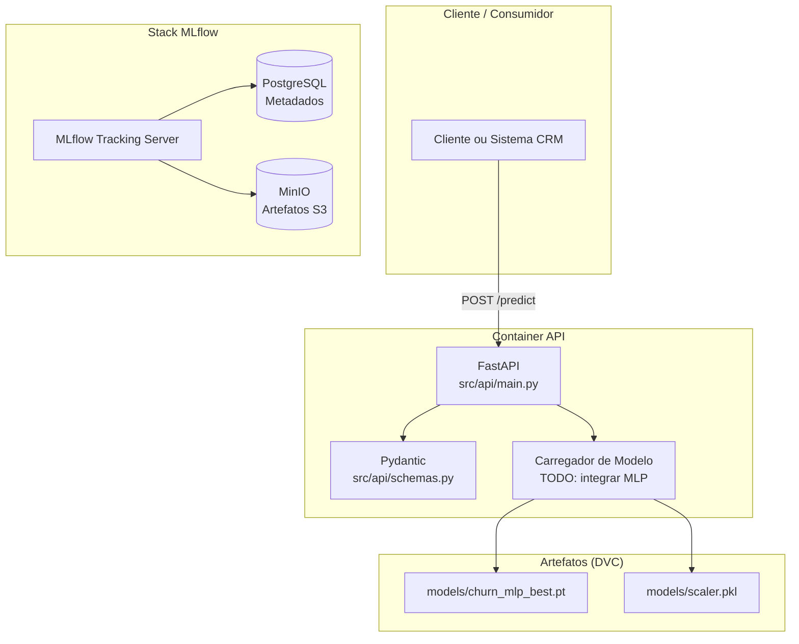
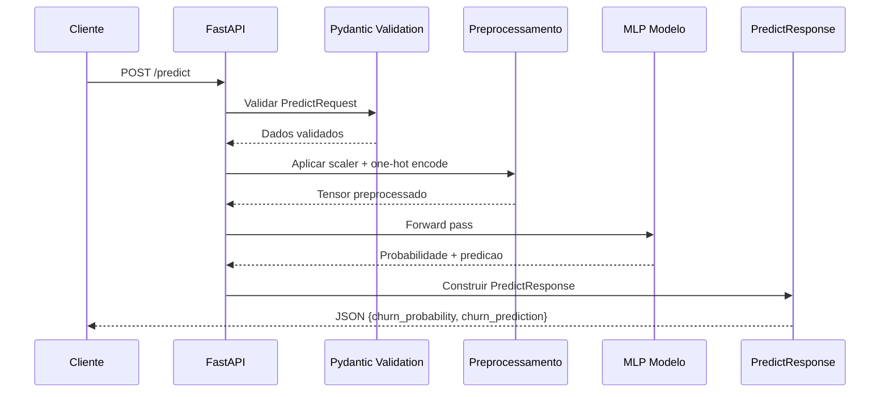
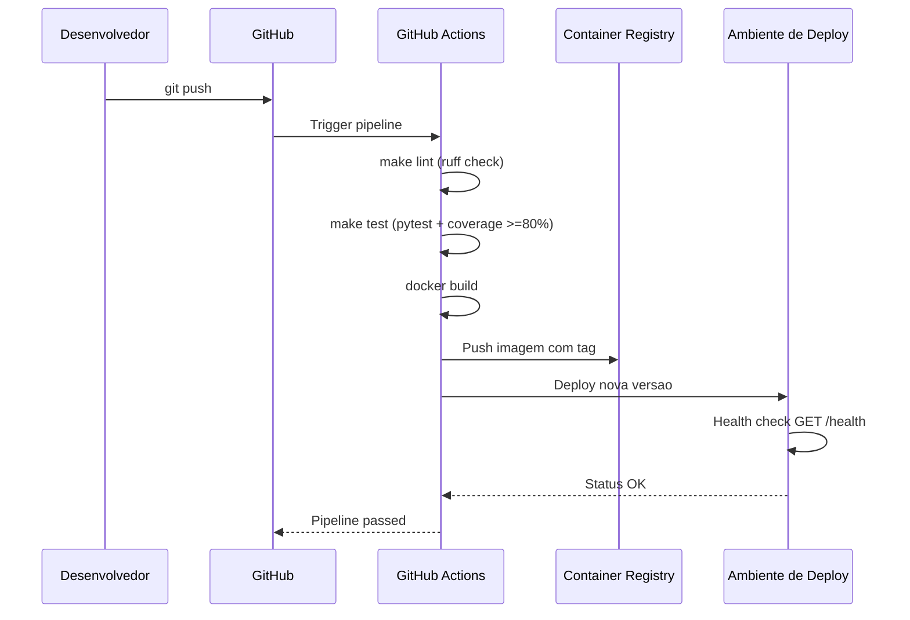

# Arquitetura de Deploy -- Churn Prediction API

## 1. Visao Geral

Este documento descreve a arquitetura de deploy do pipeline de predicao de
churn para clientes de telecomunicacoes. O sistema utiliza um modelo MLP
treinado com PyTorch, exposto via API REST com FastAPI, e orquestrado com
Docker Compose.

O objetivo e garantir a reproducibilidade do ambiente, facilitar implantacoes
futuras em cloud e documentar as decisoes tecnicas tomadas pelo time.

Links relacionados:
- [Plano de Monitoramento](MONITORAMENTO.md)

## 2. Componentes do Sistema

### 2.1 FastAPI Application (`src/api/main.py`)

- **Endpoint GET `/health`**: saude da API.
- **Endpoint POST `/predict`**: recebe dados do cliente e retorna a
  probabilidade de churn e a predicao binaria.
- **Validacao Pydantic**: `PredictRequest` e `PredictResponse`
  (`src/api/schemas.py`) com `strict=True` e `extra="forbid"`.
- **Status atual**: logica mock baseada no campo `tenure`
  (TODO: integrar modelo MLP real e scaler).

### 2.2 Modelo MLP (`src/training/mlp/model.py`)

- **Arquitetura**: 128 -> 64 -> 32 com BatchNorm e Dropout (0.3).
- **Checkpoint**: `models/churn_mlp_best.pt` (rastreado via DVC).
- **Preprocessamento**: `models/scaler.pkl` (StandardScaler, rastreado via DVC).
- **Treinamento**: PyTorch com early stopping e learning rate scheduling
  (`src/training/mlp/trainer.py`).

### 2.3 MLflow Tracking Server (`docker/docker-compose.yml`)

- **PostgreSQL**: backend store para metadados de experimentos.
- **MinIO**: artifact store compativel com S3 para modelos e artefatos.
- **MLflow Server**: UI disponivel em `http://localhost:5000`.
- **Setup automatico**: container `minio-setup` cria o bucket no primeiro
  start.

### 2.4 Containerizacao (`docker/`)

- **`Dockerfile.api`**: imagem base `ghcr.io/astral-sh/uv:python3.12-bookworm-slim`,
  gerenciamento de dependencias via `uv sync --frozen`.
- **`docker-compose.api.yml`**: ambiente de desenvolvimento com hot-reload,
  mapeamento de volume para `src/api/`.
- **`Dockerfile.mlflow`**: imagem customizada com `psycopg2-binary` e `boto3`.
- **`docker-compose.yml`**: stack completa do MLflow (postgres, minio,
  mlflow-server, minio-setup).

## 3. Estrategia de Inferencia

### 3.1 Real-time (Atual)

A API FastAPI expoe inferencia sincrona via `POST /predict`. Esta abordagem
e ideal para integracao direta com sistemas externos (CRM, call center, etc.)
que precisam de resposta imediata.

- **Latencia esperada**: sub-200ms localmente (com modelo carregado).
- **Formato de entrada**: JSON validado por Pydantic (ex:
  `PredictRequest`).
- **Formato de saida**: JSON com probabilidade e predicao binaria
  (`PredictResponse`).

### 3.2 Batch (Alternativa)

Para processamento de grandes volumes de clientes de uma so vez (ex:
  relatorio semanal de risco de churn), a abordagem batch e mais
  eficiente.

- **Implementação**: pipeline agendado (cron ou Airflow), leitura de CSV,
  aplicação do modelo em lote via `src/pipelines/run_mlp.py`.
- **Vantagens**: menor custo computacional, melhor aproveitamento do
  hardware.
- **Migração futura**: adicionar endpoint `POST /batch` ou script
  standalone para processamento noturno.

### 3.3 Comparativo

| Criterio | Real-time | Batch |
|----------|-----------|-------|
| Latencia | Baixa (< 200ms) | Alta (minutos a horas) |
| Volume | Individual | Massivo |
| Custo | Mais alto (API sempre no ar) | Mais baixo (sob demanda) |
| Complexidade | Media (requer API) | Baixa (script + scheduler) |
| Caso de uso | Integracao CRM, call center | Relatorio semanal, analise |

## 4. Opcoes de Deploy em Cloud

O projeto foi projetado para ser cloud-agnostic via Docker. Abaixo estao as
principais opcoes:

### 4.1 AWS

- **ECS Fargate**: executar containers Docker sem gerenciar servidores.
  Ideal para o custo-beneficio do projeto.
- **SageMaker**: se houver necessidade de endpoints gerenciados com auto-scaling
  e A/B testing de modelos.
- **ECR**: repositorio privado para as imagens Docker.

### 4.2 Azure

- **Container Instances**: executar containers simples com baixa latencia de
  start.
- **Azure ML**: se houver necessidade de experimentacao e deploy gerenciado
  de modelos.
- **Container Registry**: repositorio de imagens.

### 4.3 GCP

- **Cloud Run**: serverless para containers, escala ate zero, paga-se por
  requisicao. Maior custo-beneficio para trafego esporadico.
- **Vertex AI**: para pipelines de MLOps completos com monitoramento integrado.
- **Artifact Registry**: repositorio de imagens.

### 4.4 Comparativo Resumido

| Cloud | Servico Recomendado | Vantagem | Desvantagem |
|-------|---------------------|----------|-------------|
| AWS | ECS Fargate | Ampla documentacao | Cobranca mais complexa |
| Azure | Container Instances | Integracao com .NET | Latencia inicial |
| GCP | Cloud Run | Escala ate zero | Limites de timeout |

**Recomendacao do time**: iniciar com Cloud Run (GCP) ou ECS Fargate (AWS)
para manter a simplicidade.

## 5. Escalabilidade

### 5.1 Horizontal

- Replicas do container da API gerenciadas pelo orquestrador (ECS, Kubernetes,
  Cloud Run).
- Sem estado (stateless): cada request e independente, facilitando o balanceamento
  de carga.
- O modelo e artefatos (`.pt`, `.pkl`) podem ser montados em volume ou
  carregados em memoria no startup.

### 5.2 Vertical

- Ajuste de recursos do container: maior CPU e memoria para processar
  batches maiores.
- GPU nao e necessaria para inferencia deste modelo MLP (latencia aceitavel
  em CPU).

### 5.3 Auto-scaling

- **Metricas sugeridas**: requests por segundo, latencia p95, uso de CPU.
- **Politica**: escalar horizontalmente a partir de 70% de CPU ou latencia
  p95 > 300ms.
- **Min e Max replicas**: minimo 1, maximo 5 (pode ser ajustado conforme
  demanda).

## 6. Pipeline CI/CD

### 6.1 Integracao Continua (CI)

Ferramenta sugerida: GitHub Actions.

Stages na pipeline:
- **Lint**: `make lint` (ruff check).
- **Type check**: `uv run mypy src/`.
- **Testes**: `make test` (pytest com coverage minimo de 80%).
- **Build Docker**: `docker build -f docker/Dockerfile.api .`.
- **Security scan**: Trivy ou Snyk na imagem Docker (opcional).

### 6.2 Deploy Continuo (CD)

- **Staging**: imagem e deployada em ambiente de homologacao (Cloud Run ou
  ECS staging).
- **Smoke test**: health check (`GET /health`) e teste de predicacao
  (`POST /predict`) no ambiente de staging.
- **Promocao para producao**: merge na branch `main` dispara deploy
  automatico.
- **Rollback**: em caso de falha no health check, reverter para imagem
  anterior via tag Docker.

## 7. Diagramas de Arquitetura

### 7.1 Diagrama de Componentes (Infraestrutura)

### 7.2 Diagrama de Fluxo de Dados (Inferencia Real-time)

### 7.3 Diagrama de Pipeline CI/CD

## 8. Variaveis de Ambiente

As variaveis essenciais estao definidas em `.env.example`. As principais para
producao sao:

| Variavel | Descricao | Exemplo |
|----------|-----------|---------|
| `MLFLOW_TRACKING_URI` | URI do MLflow Server | `http://localhost:5000` |
| `MLFLOW_S3_ENDPOINT_URL` | Endpoint do MinIO | `http://localhost:9000` |
| `AWS_ACCESS_KEY_ID` | Chave de acesso MinIO | `minioadmin` |
| `AWS_SECRET_ACCESS_KEY` | Chave secreta MinIO | `minioadmin_secret_key_2024` |
| `POSTGRES_USER` | Usuario do PostgreSQL | `mlflow` |
| `POSTGRES_PASSWORD` | Senha do PostgreSQL | `mlflow_secure_password_2024` |
| `MLFLOW_PORT` | Porta do MLflow Server | `5000` |
| `MLFLOW_WORKERS` | Workers do Gunicorn | `2` |

## 9. Limitacoes Atuais

- O endpoint `/predict` utiliza logica mock (`tenure` < 12 => 85% churn).
  Integracao com o modelo MLP real e pendente (proxima sprint).
- A API nao possui autenticação (bearer token ou API key).
- Nao ha rate limiting implementado.
- MLflow e MinIO estao com credenciais padrao (`minioadmin`), inadequadas
  para producao.
- Nao ha TLS/HTTPS configurado na API ou no MLflow.
- O monitoramento em tempo real depende de infraestrutura adicional
  (Prometheus/Grafana).
