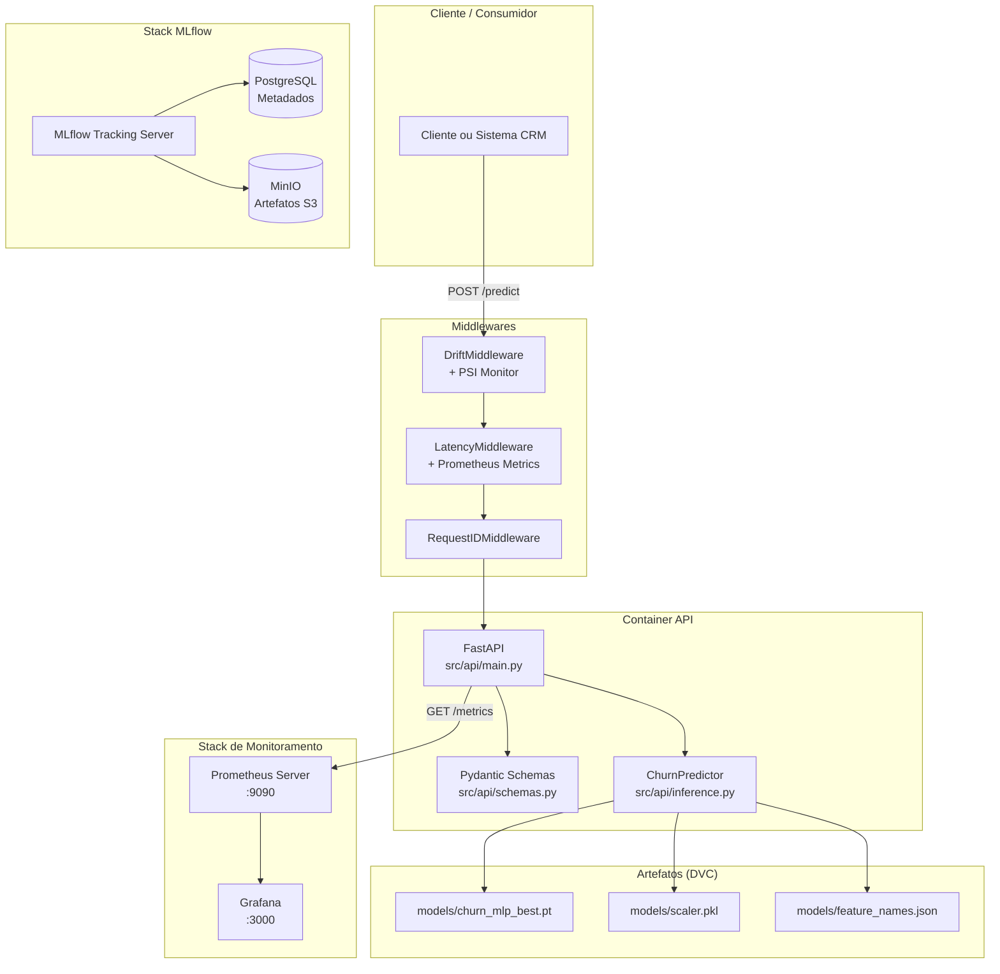
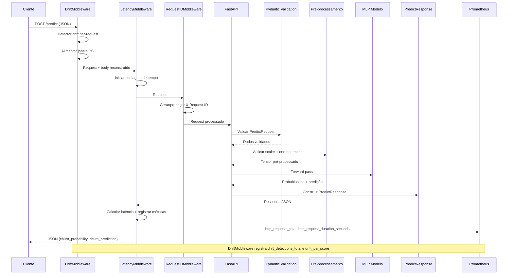
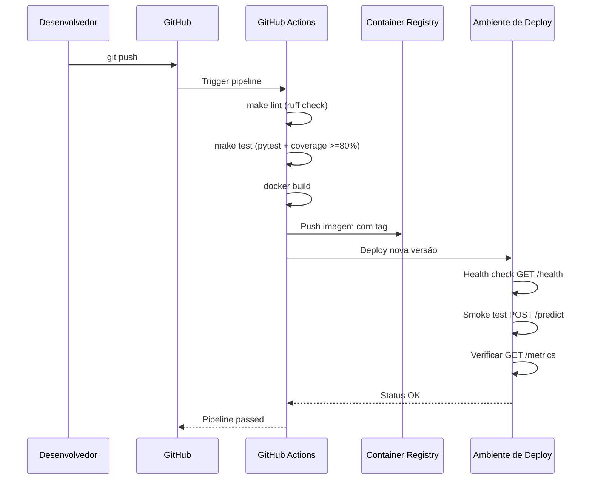
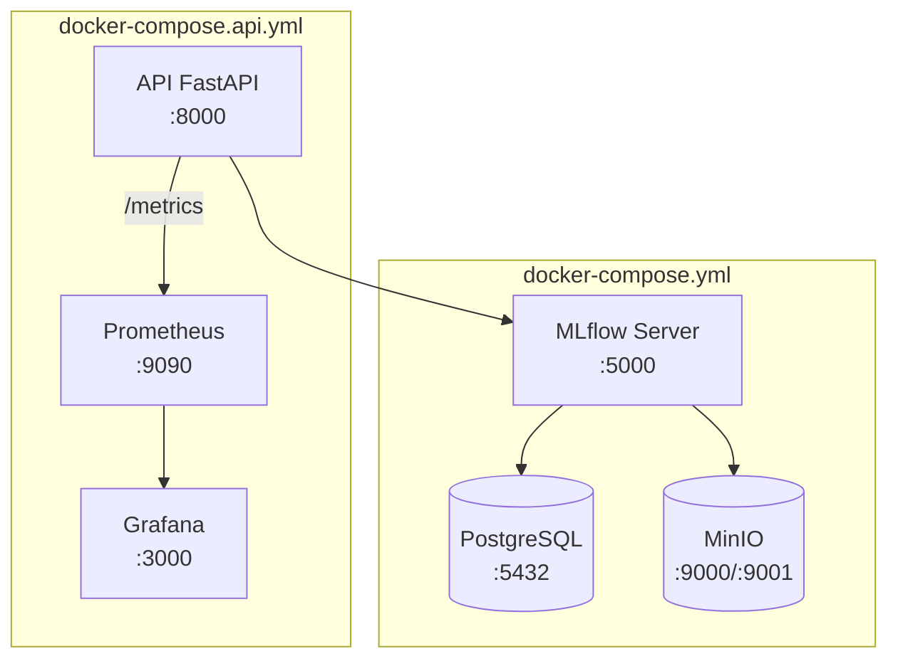

# Arquitetura de Deploy -- Churn Prediction API

## 1. Visão Geral

Este documento descreve a arquitetura de deploy do pipeline de predição de
churn para clientes de telecomúnicações. O sistema útiliza um modelo MLP
treinado com PyTorch, exposto via API REST com FastAPI, com monitoramento
integrado via Prometheus + Grafana, e orquestrado com Docker Compose.

O objetivo e garantir a reproducibilidade do ambiente, facilitar implantações
futuras em cloud e documentar as decisoes técnicas tomadas pelo time.

Links relacionados:
- [Plano de Monitoramento](MONITORAMENTO.md)

## 2. Componentes do Sistema

### 2.1 FastAPI Application (`src/api/main.py`)

- **Endpoint GET `/health`**: saude da API.
- **Endpoint POST `/predict`**: recebe dados do cliente e retorna a
  probabilidade de churn e a predição binaria, processada pelo modelo MLP
  real via `ChurnPredictor`.
- **Endpoint GET `/metrics`**: expoe métricas no formato Prometheus para
  scraping por agentes de monitoramento.
- **Validação Pydantic**: `PredictRequest` e `PredictResponse`
  (`src/api/schemas.py`) com `strict=True` e `extra="forbid"`.
- **Modelo real**: inferencia realizada pelo `ChurnPredictor`
  (`src/api/inference.py`) que carrega o modelo MLP, scaler e feature names
  de forma lazy (singleton).

### 2.2 Modelo MLP (`src/training/mlp/model.py`)

- **Arquitetura**: 128 -> 64 -> 32 com BatchNorm e Dropout (0.3).
- **Checkpoint**: `models/churn_mlp_best.pt` (rastreado via DVC).
- **Pré-processamento**: `models/scaler.pkl` (StandardScaler, rastreado via DVC)
  e `models/feature_names.json` (lista ordenada de features do treino).
- **Treinamento**: PyTorch com early stopping e learning rate scheduling
  (`src/training/mlp/trainer.py`).
- **Inferencia**: `ChurnPredictor` carrega modelo, scaler e feature names
  sob demanda (lazy loading), pré-processa one-hot encoding com categorias
  fixas e aplica StandardScaler.

### 2.3 Middlewares (`src/api/middleware/`)

Stack de middlewares ASGI que intercepta requisições antes e depois do
endpoint:

- **RequestIDMiddleware** (`request_id.py`): gera ou propaga `X-Request-ID`
  em cada requisição. Suporta tracing distribu ido e injeta o ID nos logs
  via `ContextVar`.
- **LatencyMiddleware** (`latency.py`): mede latência wall-clock de cada
  requisição, registra métricas Prometheus
  (`http_requests_total`, `http_request_duration_seconds`) e emite WARNING
  quando o SLO (default: 500ms) é violado.
- **DriftMiddleware** (`drift.py`): intercepta requisições `POST /predict`,
  detecta data drift per-request (out-of-range para numéricas, categorias
  inéditas para categoricas) e acumula janelas de PSI para features
  numéricas. Registra métricas `drift_detections_total` e
  `drift_psi_score` no Prometheus.

Ordem de registro (LIFO no FastAPI, último registrado executa primeiro na
entrada):
1. DriftMiddleware (último registrado = primeiro na entrada)
2. RequestIDMiddleware
3. LatencyMiddleware

### 2.4 Stack de Monitoramento (`docker/docker-compose.api.yml`)

O ambiente de desenvolvimento inclui Prometheus e Grafana alongside a API:

- **Prometheus** (`prom/prometheus:v3.2.0`): scraping do endpoint `/metrics`
  da API a cada 15s. Dados armazenados por 15 dias.
- **Grafana** (`grafana/grafana:11.6.1`): dashboards pré-provisionados para
  métricas operacionais e monitoramento de drift.
  - Dashboard "API Churn - Métricas Operacionais": requisições totais, taxa
    de erros 5xx, latência p99, distribuição de probabilidades de churn,
    distribuição de status HTTP.
  - Dashboard "API Churn - Data Drift": detecções de drift, taxa de drift,
    drift por feature, histograma de probabilidades, status OK/DRIFT,
    PSI por feature.
- **Provisionamento automático**: datasources e dashboards são carregados
  via arquivos YAML/JSON em `docker/grafana/provisioning/`.

### 2.5 MLflow Tracking Server (`docker/docker-compose.yml`)

- **PostgreSQL**: backend store para metadados de experimentos.
- **MinIO**: artifact store compatível com S3 para modelos e artefatos.
- **MLflow Server**: UI disponivel em `http://localhost:5000`.
- **Setup automático**: container `minio-setup` cria o bucket no primeiro
  start.

### 2.6 Containerização (`docker/`)

- **`Dockerfile.api`**: imagem base `ghcr.io/astral-sh/uv:python3.12-bookworm-slim`,
  gerenciamento de dependencias via `uv sync --frozen`.
- **`docker-compose.api.yml`**: stack completa de desenvolvimento com:
  - API com hot-reload (volume `src/` mapeado).
  - Prometheus scraping a cada 15s.
  - Grafana com dashboards pré-provisionados.
  - Portas: API (8000), Prometheus (9090), Grafana (3000).
- **`Dockerfile.mlflow`**: imagem customizada com `psycopg2-binary` e `boto3`.
- **`docker-compose.yml`**: stack completa do MLflow (postgres, minio,
  mlflow-server, minio-setup).

### 2.7 Modulos Auxiliares

- **`src/api/metrics.py`**: definicao das métricas Prometheus:
  `http_requests_total`, `http_request_duration_seconds`,
  `prediction_probability`, `drift_detections_total`, `drift_psi_score`.
- **`src/api/logging.py`**: logging estruturado JSON com `ContextVar` para
  request ID. Suporta formato texto para desenvolvimento local.
- **`src/api/drift.py`**: detecção per-request de data drift (range check
  para features numéricas, categoria inédita para features categoricas).
- **`src/api/drift_monitor.py`**: monitoramento de drift por janela
  (buffer circular de 200 amostras) com calculo de PSI real contra
  baseline de treino.
- **`src/api/monitoring/load_tester.py`**: ferramenta de carga para testes
  de performance, com consulta de métricas ao Prometheus via PromQL.

## 3. Estratégia de Inferencia

### 3.1 Real-time (Atual)

A API FastAPI expoe inferencia síncrona via `POST /predict`. Esta abordagem
e ideal para integracao direta com sistemas externos (CRM, call center, etc.)
que precisam de resposta imédiata.

- **Latência esperada**: sub-200ms localmente (com modelo carregado).
- **Formato de entrada**: JSON validado por Pydantic (ex:
  `PredictRequest`).
- **Formato de saída**: JSON com probabilidade e predição binaria
  (`PredictResponse`).
- **Pipeline completo**: recebimento -> validação Pydantic -> detecção de
  drift (DriftMiddleware) -> pré-processamento (one-hot + scaler) -> forward
  pass MLP -> resposta JSON. Cada etapa e monitorada via middleware e métricas
  Prometheus.

### 3.2 Batch (Alternativa)

Para processamento de grandes volumes de clientes de uma so vez (ex:
relatorio semanal de risco de churn), a abordagem batch é mais eficiente.

- **Implementação**: pipeline agendado (cron ou Airflow), leitura de CSV,
  aplicação do modelo em lote via `src/pipelines/train_mlp.py`
  (adaptado para inferencia).
- **Vantagens**: menor custo computacional, melhor aproveitamento do
  hardware.
- **Migracao futura**: adicionar endpoint `POST /batch` ou script
  standalone para processamento noturno.

### 3.3 Comparativo

| Critério | Real-time | Batch |
|----------|-----------|-------|
| Latência | Baixa (< 200ms) | Alta (minutos a horas) |
| Volume | Individual | Massivo |
| Custo | Mais alto (API sempre no ar) | Mais baixo (sob demanda) |
| Complexidade | Media (requer API) | Baixa (script + scheduler) |
| Caso de uso | Integracao CRM, call center | Relatorio semanal, análise |

## 4. Opções de Deploy em Cloud

O projeto foi projetado para ser cloud-agnostic via Docker. Abaixo estao as
principais opções:

### 4.1 AWS

- **ECS Fargate**: executar containers Docker sem gerenciar servidores.
  Ideal para o custo-beneficio do projeto.
- **SageMaker**: se houver necessidade de endpoints gerenciados com auto-scaling
  e A/B testing de modelos.
- **ECR**: repositorio privado para as imagens Docker.

### 4.2 Azure

- **Container Instances**: executar containers simples com baixa latência de
  start.
- **Azure ML**: se houver necessidade de experimentacao e deploy gerenciado
  de modelos.
- **Container Registry**: repositorio de imagens.

### 4.3 GCP

- **Cloud Run**: serverless para containers, escala ate zero, paga-se por
  requisição. Maior custo-beneficio para tráfego esporadico.
- **Vertex AI**: para pipelines de MLOps completos com monitoramento integrado.
- **Artifact Registry**: repositorio de imagens.

### 4.4 Comparativo Resumido

| Cloud | Servico Recomendado | Vantagem | Desvantagem |
|-------|---------------------|----------|-------------|
| AWS | ECS Fargate | Ampla documentacao | Cobrança mais complexa |
| Azure | Container Instances | Integracao com .NET | Latência inicial |
| GCP | Cloud Run | Escala ate zero | Limites de timeout |

**Recomendação do time**: iniciar com Cloud Run (GCP) ou ECS Fargate (AWS)
para manter a simplicidade.

## 5. Escalabilidade

### 5.1 Horizontal

- Replicas do container da API gerenciadas pelo orquestrador (ECS, Kubernetes,
  Cloud Run).
- Sem estado (stateless): cada request e independente, facilitando o balanceamento
  de carga. O modelo e carregado uma única vez em memória (singleton).
- Artefatos (`.pt`, `.pkl`, `.json`) são montados em volume ou copiados para
  a imagem Docker.

### 5.2 Vertical

- Ajuste de recursos do container: maior CPU e memória para processar
  batches maiores.
- GPU não e necessaria para inferencia deste modelo MLP (latência aceitavel
  em CPU).

### 5.3 Auto-scaling

- **Métricas sugeridas**: requests por segundo, latência p95, uso de CPU.
- **Politica**: escalar horizontalmente a partir de 70% de CPU ou latência
  p95 > 300ms.
- **Min e Max replicas**: mínimo 1, maximo 5 (pode ser ajustado conforme
  demanda).

## 6. Pipeline CI/CD

### 6.1 Integracao Contínua (CI)

Ferramenta sugerida: GitHub Actions.

Stages na pipeline:
- **Lint**: `make lint` (ruff check).
- **Type check**: `uv run mypy src/`.
- **Testes**: `make test` (pytest com coverage mínimo de 80%).
- **Build Docker**: `docker build -f docker/Dockerfile.api .`.
- **Security scan**: Trivy ou Snyk na imagem Docker (opcional).

### 6.2 Deploy Continuo (CD)

- **Staging**: imagem e deployada em ambiente de homologação (Cloud Run ou
  ECS staging).
- **Smoke test**: health check (`GET /health`), predição (`POST /predict`)
  e verificação de métricas (`GET /metrics`) no ambiente de staging.
- **Promoção para produção**: merge na branch `main` dispara deploy
  automático.
- **Rollback**: em caso de falha no health check, reverter para imagem
  anterior via tag Docker.

### 6.3 Testes de Carga

A ferramenta `src/api/monitoring/load_tester.py` permite testes de carga
na API com relatorio de métricas coletado do Prometheus:

```bash
# Teste discreto (100 requisições)
uv run python -m src.pipelines.explore_metrics --requests 100

# Teste contínuo (~5 req/s)
uv run python -m src.pipelines.explore_metrics --watch --rate 5

# Via Makefile
make api-load           # batch (default: 100 reqs)
make api-load-watch     # contínuo (default: 5 req/s, Ctrl+C para parar)
```

## 7. Diagramas de Arquitetura

### 7.1 Diagrama de Componentes (Infraestrutura)



### 7.2 Diagrama de Fluxo de Dados (Inferencia Real-time)



### 7.3 Diagrama de Pipeline CI/CD



### 7.4 Diagrama do Stack Docker Compose



## 8. Variáveis de Ambiente

As variáveis essenciais estao definidas em `.env.example`. As principais para
produção são:

| Variavel | Descrição | Exemplo |
|----------|-----------|---------|
| `MLFLOW_TRACKING_URI` | URI do MLflow Server | `http://localhost:5000` |
| `MLFLOW_S3_ENDPOINT_URL` | Endpoint do MinIO | `http://localhost:9000` |
| `AWS_ACCESS_KEY_ID` | Chave de acesso MinIO | `minioadmin` |
| `AWS_SECRET_ACCESS_KEY` | Chave secreta MinIO | `minioadmin_secret_key_2024` |
| `POSTGRES_USER` | Usuario do PostgreSQL | `mlflow` |
| `POSTGRES_PASSWORD` | Senha do PostgreSQL | `mlflow_secure_password_2024` |
| `MLFLOW_PORT` | Porta do MLflow Server | `5000` |
| `MLFLOW_WORKERS` | Workers do Gúnicorn | `2` |
| `API_PORT` | Porta da API FastAPI | `8000` |
| `LOG_LEVEL` | Nivel de log (DEBUG, INFO, WARNING, ERROR) | `INFO` |
| `LOG_FORMAT` | Formato de log (json ou text) | `json` |
| `PREDICTION_SLO_MS` | Limiar de latência SLO em ms | `500.0` |
| `GRAFANA_ADMIN_USER` | Usuario admin do Grafana | `admin` |
| `GRAFANA_ADMIN_PASSWORD` | Senha admin do Grafana | `admin` |

## 9. Limitações Atuais

- A API não possui autenticacao (bearer token ou API key).
- Não ha rate limiting implementado.
- MLflow e MinIO estao com credenciais padrão (`minioadmin`), inadequadas
  para produção.
- Não ha TLS/HTTPS configurado na API ou no MLflow.
- O Grafana esta com credenciais padrão (`admin/admin`), inadequadas para
  produção.
- Retreinamento automático não esta implementado (apenas manual via
  `make train-mlp`).